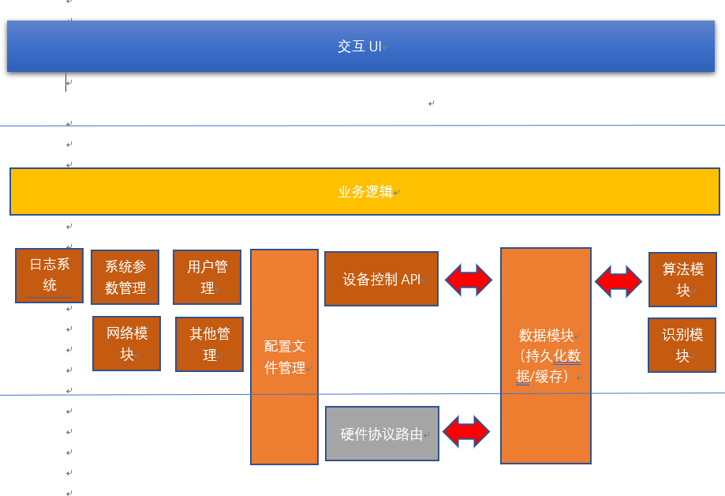

#  2018 Annual Summary 
## 工作梳理
### Ratel
Ratel 项目经历了android板选型，最初使用树莓派，后来认识到树莓派如果作为产品有很多问题:
1. 硬件性能不稳定 
2. 没有较好的稳定供应商
3. android things 在树莓派中性能太差
4. 树莓派在java上运行性能较差
5. 不符合工控标准

之后选型改用工控android板。之后完成了以下内容:
1. 收集了需求，整理了需求文档，
2. 根据需求进行了软件架构设计，软件架构设计按通用软件项目进行初始设计。同时划分了功能模块，初始系统层架构图如下:

3. 确定了技术实现细节，业务逻辑层等层面使用java实现,算法模块，通讯模块，使用C++进行实现,c++和java间使用了jni-ndk接口。
4. 在具体c++实现时考虑了后续通用性，通讯模块进行了通用性设计。
5. 拆解任务，制定开发规划。
6. 为了稳定性，实现了业务逻辑核心部分后交付胡杨昌进行实现
7. 带着胡杨昌实现了其他部分功能。
8. 和吴峰确定了核心算法接口。
9. 跟踪了v0.0 v1.0 版本安装和调试，加入新功能。通讯部分加入了CAN总线实现。
10. 实现初版web端方案
#### 个人积累
1. 在实现通讯部分时，详细学习了usb协议，并阅读了开源libusb代码。
2. 对can总线协议进行了学习.
3. 增长完整的软件架构设计过程
#### 总结：

4. 积累了完整的软件开发设计流程，在当前流程中，
5. 建立了maven 作为库设计
6. 建立了完整的gitflow

### GAS 

### MS 

### 快递柜

### 其他

## 技能水平 
todo 概括图标

## 问题 不足
